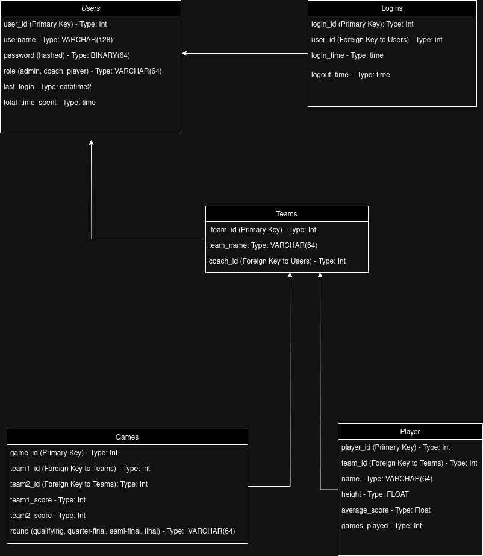

<h1 align="center">Basketball Monitoring System</h1>
<h2 align="center">Basketball Monitoring System Schema</h2>


<h3> Configuration </h3>

Before getting started, make sure you have Python 3.10 and Django 5.0.6 installed on your machine.

<h3> Installing Dependencies </h3>

1. Create a virtual environment:
    ```bash
    python3 -m venv venv
    ```

2. Activate the virtual environment:
    ```bash
    source venv/bin/activate  # on Linux/macOS
    venv\Scripts\activate     # on Windows
    ```

3. Install the project dependencies:
    ```bash
    pip install -r requirements.txt
    ```

<h3> Running the Server </h3>

To start the server, run the following command in the root directory of the project:
```bash
python3 manage.py runserver
or
python manage.py runserver
```
The server will start and be accessible at http://localhost:8000/.

<h3>
Games
    List/Create: /games/ - List all games and can create a game
    Detail: /games/<int:pk>/ - List one game

Logins

    List/Create: /logins/ - List all Logins and Can Logoff the user
    Detail: /logins/<int:pk>/ - List One Detail Login

Players

    List/Create: /players/ - List Players Information and Create a Player
    Detail: /players/<int:pk>/ - Create a Player Information

Teams

    List/Create: /teams/ - List the teams
    Detail: /teams/<int:team_id>/ - List one specific team
    Players List: /teams/<int:team_id>/players/ - List the players of the specified team
    Top Players List: /teams/<int:team_id>/top-players/ - List the top players of the specified team

Users

    List/Create: /users/ - List all the users and can create a user
    Detail: /users/<int:pk>/ - List one specific user

Create a Team is only available in [text](http://127.0.0.1:8000/admin/teams/team/add/) whe you are did the coach registration
You can crate a superuser by command line or by create by insomnia
</h3>

<h3>Run the tests</h3>
python manage.py test users.tests
python manage.py test teams.tests
python manage.py test players.tests
python manage.py test logins.tests
python manage.py test games.tests

<h3> Dummy Data</h3>

The dummy data was generated using the Python Faker library. It is available in the data.py file.
API Documentation

The API documentation is available in the docs folder, where you'll find the Insomnia configuration with the configured endpoints and corresponding payloads.
